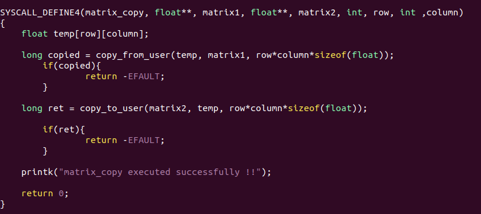

# Custom_System_Calls
Adding custom system calls to the linux kenel 5.14.3
## In this repo we are going to add custom system calls to linux kernel in just 2 steps

# Pre-requisites
## downloading and extracting the kernel source code folder
## open terminal and write these commands

- ### Download the kernel folder 
```bash
    wget https://www.kernel.org/pub/linux/kernel/v3.x/linux-3.16.tar.xz
``` 
- ### Extract the downloaded folder
```bash
    sudo tar -xvf linux-4.17.4.tar.xz -C/usr/src
```
- ### Goto into **kernel** directory in the extracted folder
```bash
    cd /usr/src/linux-4.17.4/kernel
```

- You will find a **sys.c** file in the this folder open this file (using any editor, i'm using nano here)
```bash
    nano sys.c
```
**Note** 
- **sys.c** file has all the system call funtion definations, this is where we are going to add our system call funtion

# STEP 1
## writing/adding system call
- Open **Syscall** folder of this repository to see the format a syscall & how to write a sycall funtion defination, that folder also has code for a system call (System_call.c )

- ### write your syscall code anywhere in sys.c file
- eg (save your code in the file and exit from the file )
    


- ### Adding your sycall name to the table follow these commands

```bash
    cd ..
    cd arch/x86/entry/syscalls/
    nano syscall_64.tbl
```
- ### Open syscall_64.tbl, you will find names of all the sycalls, No of syscalls can vary in different versions, go to the end of the table and add your system call to file **sycall_64.tbl**  eg. (Notice row 548 in this picture that's name of my syscall ) only replace you syscall name with mine and rest of  the things remains the same
    

# STEP 2
## Compiling and testing
Once you are done with the above steps now, navigate back to the folder where you extracted the kernel folder

- ## commands to compile
### edit config file so that only required things are compiled
```bash
    sudo make menuconfig
```
### compile the kernel
```bash
    sudo make 
```
### install modules
```bash
    sudo make modules_install install
```
### reboot system

## Testing

- There's **test.c** file in Testing foler, read the comments carefully  and make necessary changes according to your syscall and run the code. if the code compile and run successfullly that means you have added the system call correctly

- there's **demo.c** file which explains how to use the system call in a C program